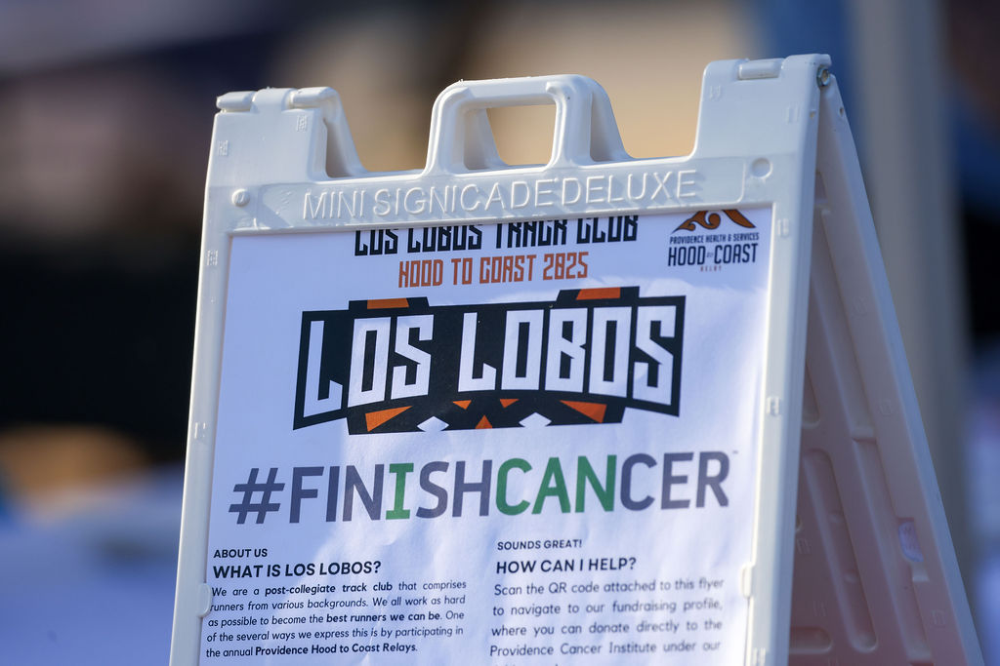
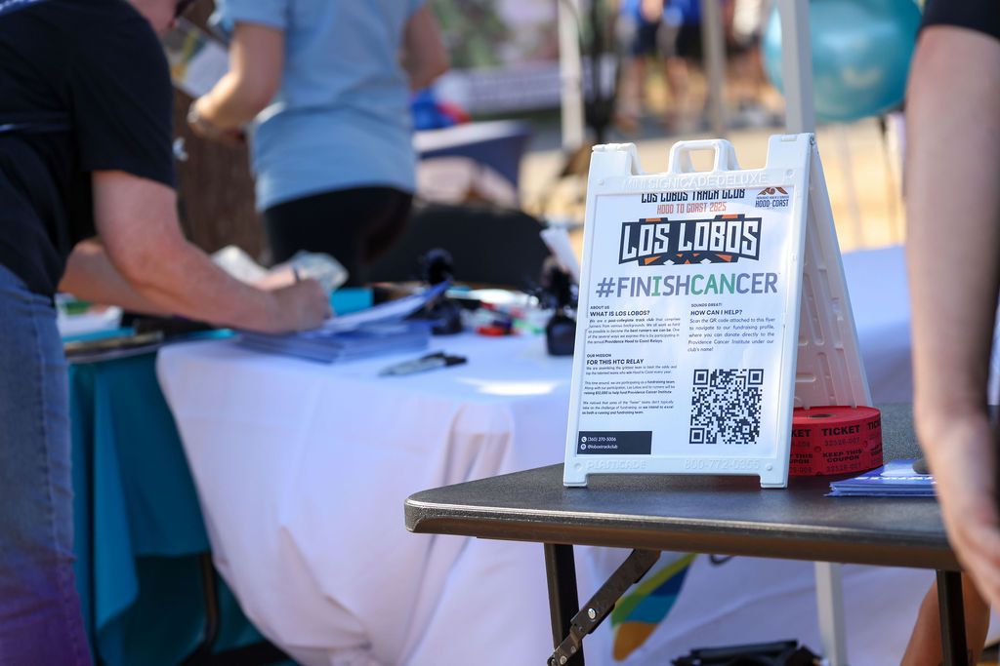
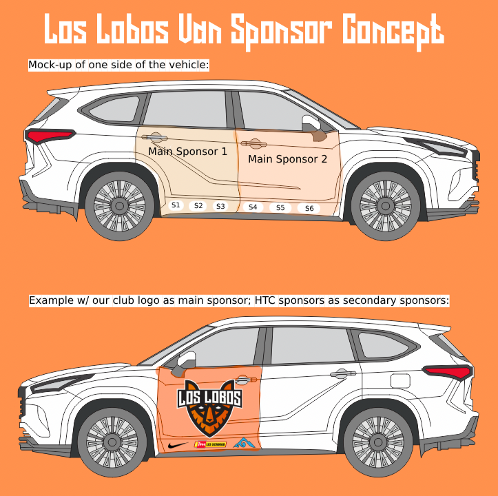
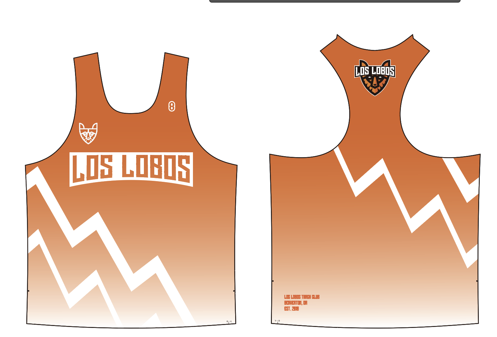
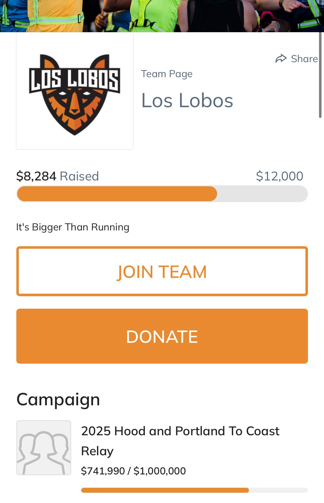
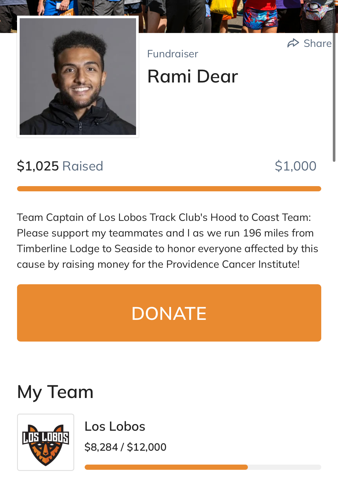
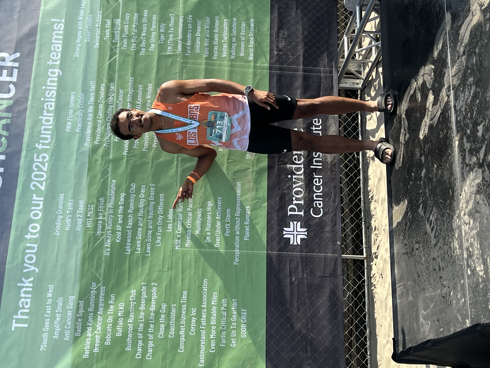

  
  <h1 style="font-size: 2.5rem; margin-bottom: 1rem; line-height: 1.1;">
    Los Lobos Track Club: Fundraising $9,100 for the Providence Cancer Institute via the Hood to Coast Relay
  </h1>

  

    As Co-founder of Los Lobos Track Club, I am always seeking ways for our club to stand out amongst other high performance teams. To address a cause that affects several of our own, I decided ahead of the 2025 Hood to Coast Relays that our team would take on the challenge of competing as a <strong>#FINISHCANCER fundraising team.</strong> We ran our way to <strong>8th place for the Men's Open Division</strong> while raising <strong>$9,000+ for the Providence Cancer Institute</strong>.
  

  

    
    
50/50 Raffle Signage at the Marion Berries Baseball "Strikeout Cancer Night"

  

  

    
    
50/50 Raffle Table

  

  

    
    
Our 2025 Hood to Coast Team at the Providence #FINISHCANCER VIP Section

  

  

    
    
Northwest Primary Care Van Sponsorship

  

  

    
    
Cascade Stems Van Sponsorship

  

  

    
    
Van Sponsorship Catalog

  

  

    
    
Collaboration Uniforms with Eight Lane Running Company

  

  

    
    
Our Fundraising Page

  

  

    
    
My Personal Fundraising Page

  

  

    
    
Myself pointing to our club's name on the #FINISHCANCER fundraising team wall

  

  <a class="prev" onclick="plusSlides(-1)">&#10094;</a>
  <a class="next" onclick="plusSlides(1)">&#10095;</a>

 
  
  
 
    <h2>Strategy</h2> 
    
While fundraising over $9,000 was a full-team effort, it was my responsibility to <strong>acquire local sponsorships and partnerships</strong> while <strong>coordinating with team members to help them fundraise successfully</strong>. Through <em>Cold-Emailing</em> and <em>Leveraging our Networks via Social Media</em>, our team was able to secure donations from various donors.
 
  
 

  
 
    <h2>Tools Used</h2> 
    <ul> 
      <li>
         <strong>Creative:</strong> <strong>Canva</strong> and <strong>Adobe Creative Cloud (Photoshop and Illustrator)</strong> were used often to create graphics used for social media, promotional materials, and mock-ups for uniforms and van door signage.
      </li>
      <li style="margin-top: 10px;">
        <strong>Execution:</strong> <strong>Meta Business Suite (Facebook/Instagram)</strong> was used to communicate fundraising requests and updates with Los Lobos club members. These platforms were also used to promote the fundraiser itself and related events, such as the 50/50 fundraiser with the Marion Berries.
      </li> 
    </ul>
  
 

    <h2>Sponsors & Partners</h2>
    <ul>
      <li>
            <strong>Van Door Sponsors:</strong> <strong>Cascade Stems</strong> and <strong>Northwest Primary Care</strong> were two companies who purchased Van Door signage, which we featured on our two team vans which drove along the whole 196-mile Hood to Coast course from Mount Hood to Seaside, Oregon. This activation put these two companies in front of the eyes of over 1,000 Hood to Coast teams (8-12 people per team) and their volunteers (about 3 per team). 
      </li> 
      <li style="margin-top: 10px;">
      <strong>Partners:</strong> <strong>Anytime Fitness Independence</strong>, <strong>Eight Lane Running Company</strong>, <strong>Marion Berries Baseball</strong>, and <strong>REVOLVR Menswear</strong> were drawn to our cause and were incredibly helpful in achieving our mission. Anytime Fitness took the time to <a href="https://www.facebook.com/reel/737930685664997" target="_blank">interview me about my club and our involvement with the #FINISHCANCER campaign</a>, and used this interview to blast our fundraiser on their socials in the build up to race day. Eight Lane Running Company helped us by producing our uniforms at a deep discount, so that the costs we would save on uniforms could go directly back into the fundraiser. <strong>Marion Berries Baseball </strong> worked with us to host three 50/50 fundraising raffles at their games, which brought in nearly <strong>$800</strong> to our fundraiser, while leaving a positive impact on the winning fans. Lastly, REVOLVR Menswear donated a $75 Gift Card for us to raffle off, which generated about another <strong>$400</strong> of donations.
      </li>
    </ul>
  

