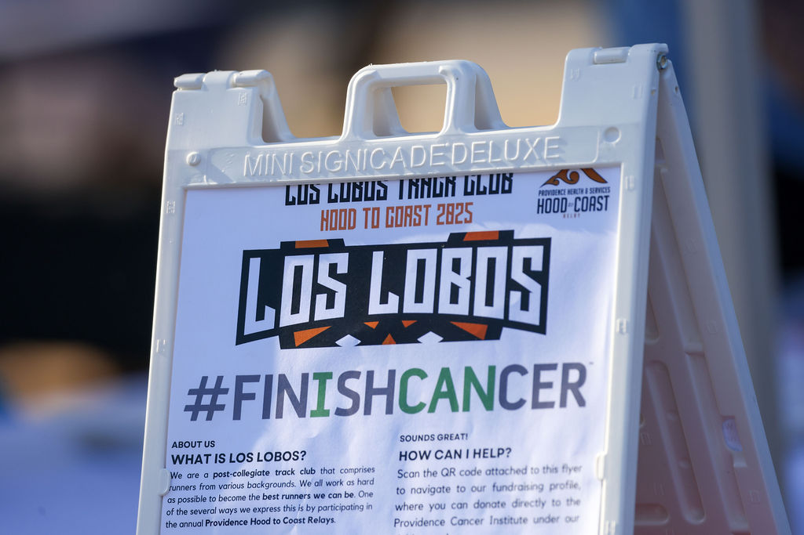
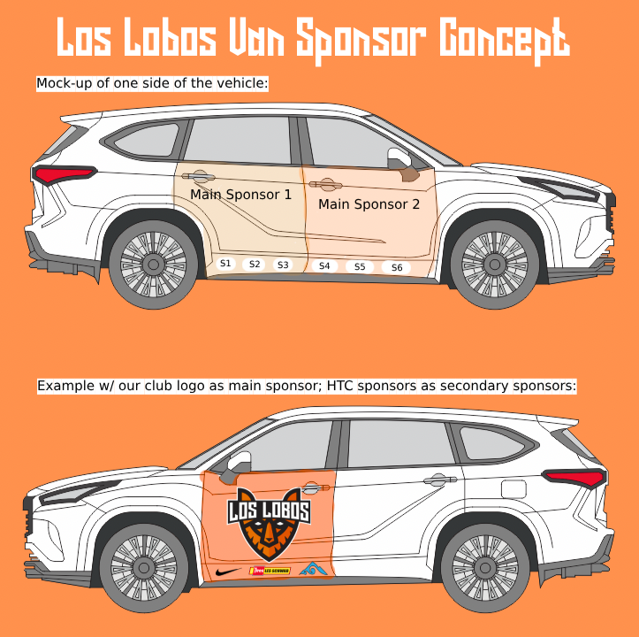
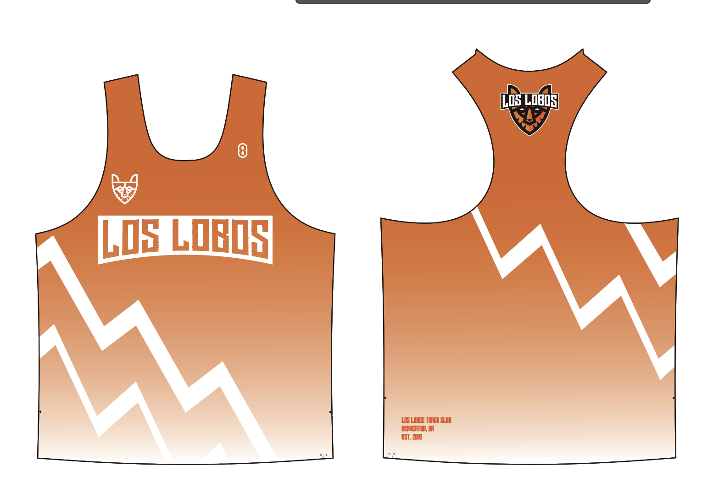
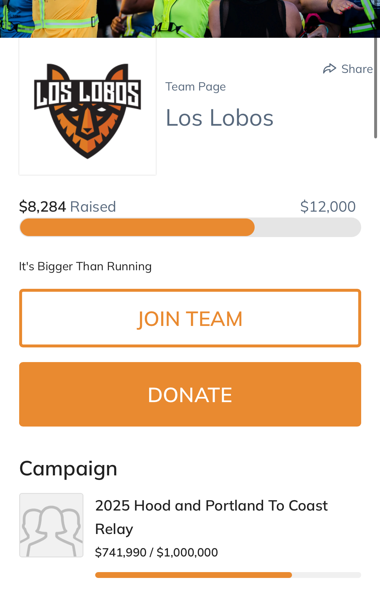
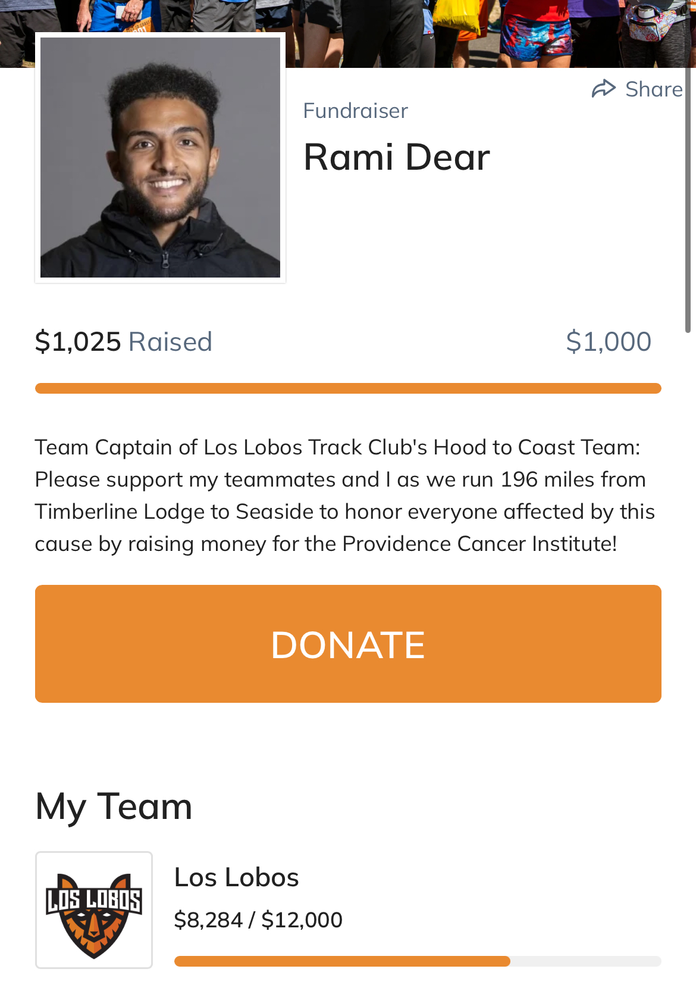
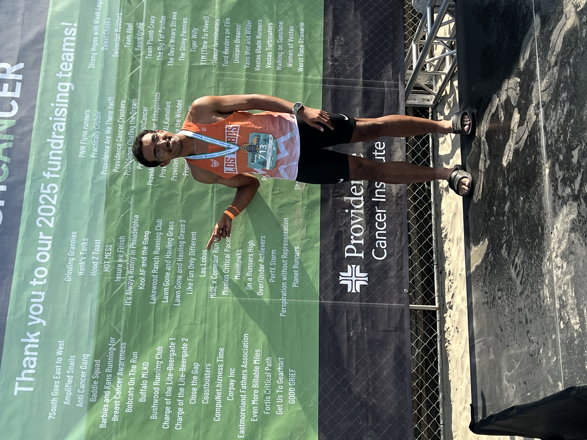

<link rel="stylesheet" href="../style.css">

<nav class="site-nav">
  Rami Dear
  <a href="../">Home</a>
  <a href="../marionberries">Marion Berries</a>
  <a href="../lobos">Los Lobos</a>
  <a href="../woucpp">WOU CPP</a>
  <a href="../content">Media</a>
  <a href="../about">About</a>
</nav>

  <h1 style="font-size: 2.5rem; margin-bottom: 1rem; line-height: 1.1;">
    Los Lobos Track Club: Fundraising $9,100 for the Providence Cancer Institute via the Hood to Coast Relay
  </h1>
  

    As Co-founder of Los Lobos Track Club, I am always seeking ways for our club to stand out amongst other high performance teams. To address a cause that affects several of our own, I decided ahead of the 2025 Hood to Coast Relays that our team would take on the challenge of competing as a <strong>#FINISHCANCER fundraising team.</strong> We ran our way to <strong>8th place for the Men's Open Division</strong> while raising <strong>$9,000+ for the Providence Cancer Institute</strong>.
  

  

    
    
50/50 Raffle Signage at the Marion Berries Baseball "Strikeout Cancer Night"

  

  

    
    
50/50 Raffle Table

  

  

    
    
Our 2025 Hood to Coast Team at the Providence #FINISHCANCER VIP Section

  

  

    
    
Northwest Primary Care Van Sponsorship

  

  

    
    
Cascade Stems Van Sponsorship

  

  

    
    
Van Sponsorship Catalog

  

  

    
    
Collaboration Uniforms with Eight Lane Running Company

  

  

    
    
Our Fundraising Page

  

  

    
    
My Personal Fundraising Page

  

  

    
    
Pointing to our club's name on the #FINISHCANCER fundraising team wall

  

  <button class="carousel-btn prev" aria-label="Previous slide">&#10094;</button>
  <button class="carousel-btn next" aria-label="Next slide">&#10095;</button>

  

    

   

        <h2>Strategy</h2>
        
While fundraising over $9,000 was a full-team effort, it was my responsibility to <strong>acquire local sponsorships and partnerships</strong> while <strong>coordinating with team members to help them fundraise successfully</strong>. Through <em>Cold-Emailing</em> and <em>Leveraging our Networks via Social Media</em>, our team was able to secure donations from various donors.

      

   

        <h2>Tools Used</h2>
        <ul style="padding-left: 1.2rem;">
          <li>
            <strong>Creative:</strong> <strong>Canva</strong> and <strong>Adobe Creative Cloud (Photoshop and Illustrator)</strong> were used to create graphics for social media, promotional materials, and mock-ups for uniforms and van door signage.
          </li>
          <li style="margin-top: 10px;">
            <strong>Execution:</strong> <strong>Meta Business Suite (Facebook/Instagram)</strong> was used to communicate fundraising requests and updates with Los Lobos club members and promote the fundraiser itself.
          </li>
        </ul>
      

   

        <h2>Van Door Sponsors</h2>
        

          <strong>Cascade Stems</strong> and <strong>Northwest Primary Care</strong> purchased van door signage featured on our two team vans, which drove the entire 196-mile Hood to Coast course from Mount Hood to Seaside, Oregon. This put both companies in front of over 1,000 Hood to Coast teams (8–12 people each) and their volunteers.
        

      

   

        <h2>Partners</h2>
        

          <strong>Anytime Fitness Independence</strong>, <strong>Eight Lane Running Company</strong>, <strong>Marion Berries Baseball</strong>, and <strong>REVOLVR Menswear</strong> were drawn to our cause and were incredibly helpful in achieving our mission.
        

        <ul style="max-width: none; margin-top: 10px; padding-left: 1.2rem;">
          <li>
            <strong>Anytime Fitness</strong> <a href="https://www.facebook.com/reel/737930685664997" target="_blank">interviewed me about the #FINISHCANCER campaign</a> and shared it on their socials.
          </li>
          <li>
            <strong>Eight Lane Running Company</strong> produced our uniforms at a deep discount so costs saved could go directly to the fundraiser.
          </li>
          <li>
            <strong>Marion Berries Baseball</strong> hosted three 50/50 fundraising raffles at their games, bringing in nearly <strong>$800</strong>.
          </li>
          <li>
            <strong>REVOLVR Menswear</strong> donated a $75 gift card for us to raffle off, generating another <strong>$400</strong>.
          </li>
        </ul>
      

  

  

  

    <h3 style="margin-bottom: 1rem; text-align: center;">Partner Interview</h3>

  <blockquote class="instagram-media"
      data-instgrm-permalink="https://www.instagram.com/reel/DMGreOWhlSm/"
      data-instgrm-version="14"
      style="background:#FFF; border:0; border-radius:3px; box-shadow:0 0 1px 0 rgba(0,0,0,0.5),0 1px 10px 0 rgba(0,0,0,0.15); margin:1px; max-width:540px; min-width:326px; padding:0; width:calc(100% - 2px);">
      

        <a href="https://www.instagram.com/reel/DMGreOWhlSm/" target="_blank" style="background:#FFFFFF; line-height:0; padding:0; text-align:center; text-decoration:none; width:100%;">
          View this post on Instagram
        </a>
      

    </blockquote>

  <a href="https://www.instagram.com/afindependenceor/reel/DMGreOWhlSm/" target="_blank" class="ig-button">
      Watch on Instagram &#8599;
    </a>

  

      <strong>Context:</strong> Discussing the mission of Los Lobos and our #FINISHCANCER campaign with Anytime Fitness Independence.
    

  

