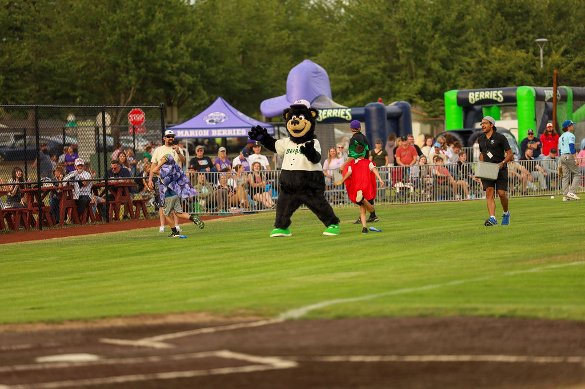

  
  <h1 style="font-size: 2.5rem; margin-bottom: 1rem; line-height: 1.1;">
    Marion Berries Baseball: Promotions and Marketing to Strenghten the Berries' Relationship with the City of Salem.
  </h1>

  

    During my summer as a Promotions Intern with the Marion Berries Baseball team, I contributed to activities which established a strong relationship with the team and Salem residents in its 2025 inaugural season. Some of these activities include <strong>the planning and execution of between-inning entertainment</strong>, <strong>developing and leading game-day activations to increase foot traffic</strong>, and <strong>the management of team social media accounts to positively engage and update the team's fans and sponsors</strong>.
  

  

    
    
"Pizza in Your Seatza" Photo Credit: Sauce Studio and Design

  

  

    
    
"Dizzy Bat Race" Photo Credit: Sauce Studio and Design

  

  

    
    
Dressing as Leroy the on-field MC, for "Trick or Treat Night"

  

  

    
    
Our 4th of July Hot Dog Eating COntest

  

  

    
    
Our 4th of July Hot Dog Eating COntest

  

  

    
    
Our 4th of July Hot Dog Eating COntest

  

  

    
    
Our 4th of July Hot Dog Eating COntest

  

  

    
    
Our 4th of July Hot Dog Eating COntest

  

  

    
    
50/50 Raffle Table

  

  

    
    
Hot Dog Eating Competition Call for Competitors

  

  

    
    
Hot Dog Eating Competition Event Details

  

  

    
    
Promotional Post for one of our 50/50 Raffle Days

  

  <a class="prev" onclick="plusSlides(-1)">&#10094;</a>
  <a class="next" onclick="plusSlides(1)">&#10095;</a>

 
 <h2>Strategy</h2> 
My role involved designing <strong>Instagram Reels</strong> and writing <strong>Radio Ad Scripts</strong>. The data suggests that <em>In-Game Events</em> and <em>Social Media</em> outperformed traditional Radio spots.
 
 
 <h2>Tools Used</h2> <ul> <li><strong>Data Analysis:</strong> JASP & Tableau</li> <li><strong>Creative:</strong> Adobe CC & Canva</li> <li><strong>Execution:</strong> Meta Business Suite</li> </ul> 
 
