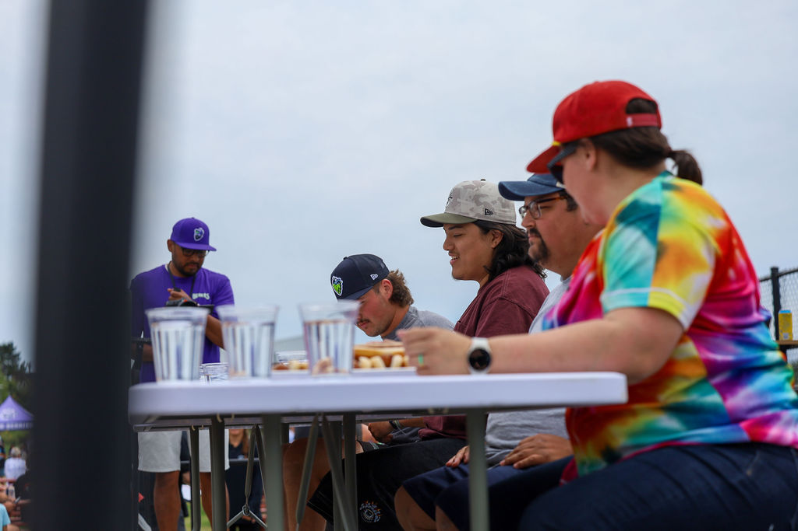
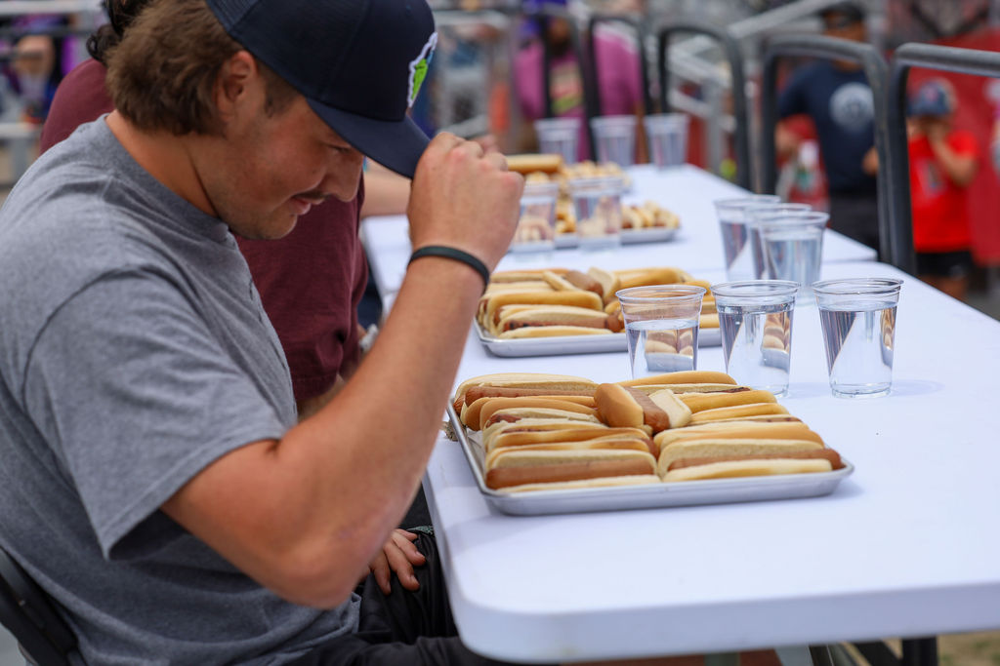
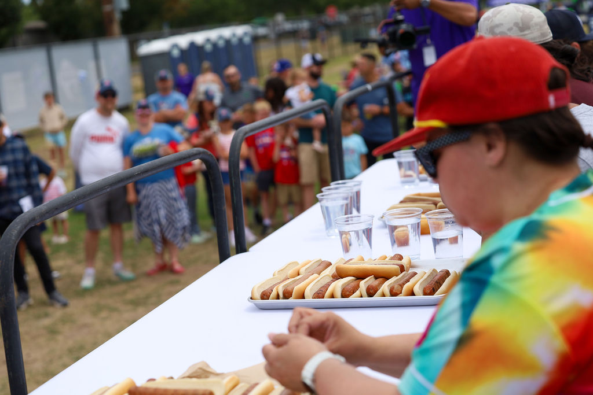
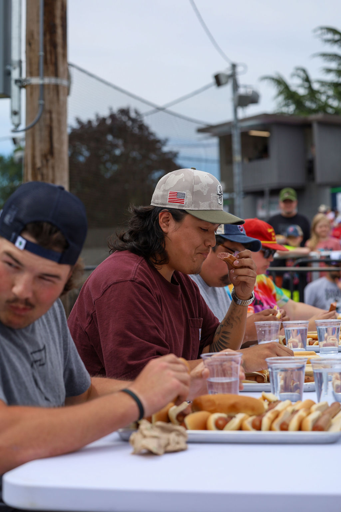
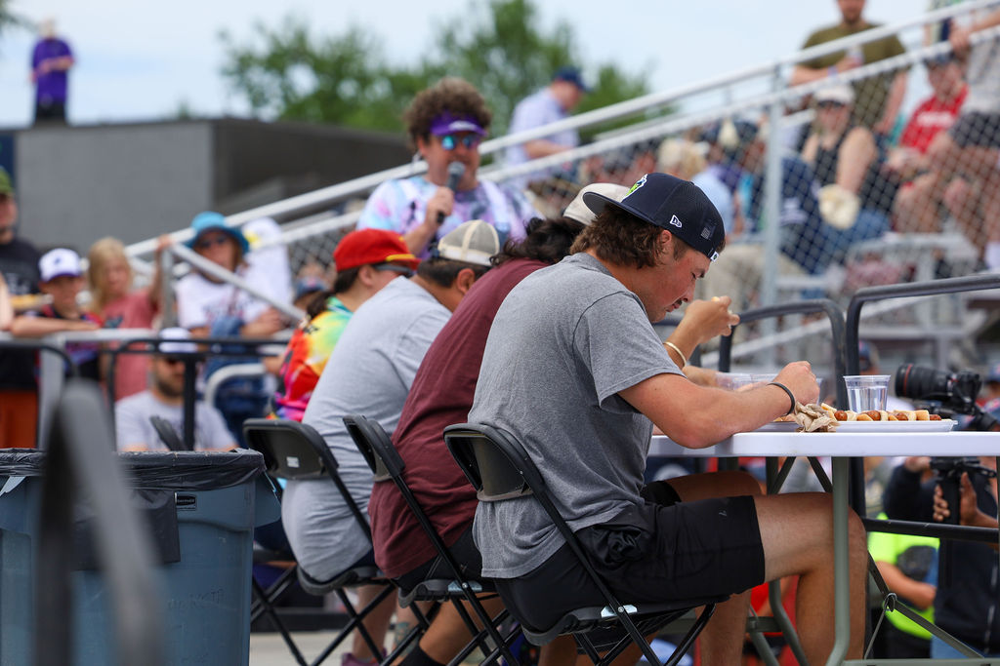

  
  <h1 style="font-size: 2.5rem; margin-bottom: 1rem; line-height: 1.1;">
    Marion Berries Baseball: Promotions and Marketing to Strenghten the Berries' Relationship with the City of Salem.
  </h1>

  

    During my summer as a Promotions Intern with the Marion Berries Baseball team, I contributed to activities which established a strong relationship with the team and Salem residents in its 2025 inaugural season. Some of these activities include <strong>the planning and execution of between-inning entertainment</strong>, <strong>developing and leading game-day activations to increase foot traffic</strong>, and <strong>the management of team social media accounts to positively engage and update the team's fans and sponsors</strong>.
  

  

    
    
"Pizza in Your Seatza" Photo Credit: Sauce Studio and Design

  

  

    
    
"Dizzy Bat Race" Photo Credit: Sauce Studio and Design

  

  

    
    
Dressing as Leroy the on-field MC, for "Trick or Treat Night"

  

  

    
    
Our 4th of July Hot Dog Eating Contest

  

  

    
    
Our 4th of July Hot Dog Eating Contest

  

  

    
    
Our 4th of July Hot Dog Eating Contest

  

  

    
    
Our 4th of July Hot Dog Eating Contest

  

  

    
    
Our 4th of July Hot Dog Eating Contest

  

  

    
    
50/50 Raffle Table

  

  

    
    
Hot Dog Eating Competition Call for Competitors

  

  

    
    
Hot Dog Eating Competition Event Details

  

  

    
    
Promotional Post for one of our 50/50 Raffle Days

  

  <a class="prev" onclick="plusSlides(-1)">&#10094;</a>
  <a class="next" onclick="plusSlides(1)">&#10095;</a>

</style>

  <h1 style="font-size: 2.5rem; line-height: 1.1;">Marion Berries Baseball: Promotions & Marketing</h1>
  

    Strengthening the relationship between a new franchise and the City of Salem through community-first activations.
  

  

    
 
      
  
 
        <h2>The Strategy</h2> 
        

           My goal was to internalize the front office's philosophy: <strong>positively impact the City of Salem</strong> by offering affordable family fun. 
        

        

           We shifted the focus from just "baseball" to "entertainment," ensuring that even casual fans left with memories to last a lifetime, regardless of the final score.
        

      
 

   
 
        <h2>Tools Used</h2> 
        <ul style="padding-left: 1.2rem;"> 
          <li style="margin-bottom: 8px;">
             <strong>Canva:</strong> Used heavily for graphics, photo, and video editing. It allowed for rapid collaboration between myself, the intern cohort, and front office staff.
          </li>
          <li>
            <strong>Meta Business Suite:</strong> The engine for our digital presence, used to schedule content and analyze engagement data for Facebook and Instagram.
          </li> 
        </ul>
      
 

  

        <h2>Community Operations</h2>
        

          Building trust required getting boots on the ground. I helped manage operational logistics that directly touched the fan experience:
        

        <ul style="margin-top: 10px; padding-left: 1.2rem;">
          <li><strong>Mascot Appearances:</strong> Bringing the brand to local events like the "Super Hero Run."</li>
          [cite_start]<li><strong>Ticket Distribution:</strong> Assisting in the logistical distribution of over <strong>6,000 Berry Passes</strong> to fans[cite: 4].</li>
          <li><strong>Fan Engagement:</strong> Running between-inning games like "The Dizzy Bat Race" to keep energy high.</li>
        </ul>
      

  

        <h2>Game Day Features</h2>
        

          To ensure repeat attendance, we treated every game as a unique event. I recommended and implemented specific features to keep the schedule fresh:
        

        <ul style="margin-top: 10px; padding-left: 1.2rem;">
          <li style="margin-bottom: 5px;"><strong>4th of July Hot Dog Eating Contest:</strong> Created to compensate for a lack of fireworks, turning a potential negative into a fan-favorite event.</li>
          <li><strong>Charity Raffles:</strong> Collaborated with Los Lobos Track Club to host a 50/50 raffle, donating proceeds to the Providence Cancer Institute.</li>
        </ul>
      

  

  

    <h3 style="margin-bottom: 1rem; text-align: center;">Fan Engagement Reel</h3>
    
   <blockquote class="instagram-media" data-instgrm-permalink="https://www.instagram.com/reel/DKaoaIYBcjO/" data-instgrm-version="14" style=" background:#FFF; border:0; border-radius:3px; box-shadow:0 0 1px 0 rgba(0,0,0,0.5),0 1px 10px 0 rgba(0,0,0,0.15); margin: 1px; max-width:540px; min-width:326px; padding:0; width:99.375%; width:-webkit-calc(100% - 2px); width:calc(100% - 2px);">
      
 
        <a href="https://www.instagram.com/reel/DKaoaIYBcjO/" style=" background:#FFFFFF; line-height:0; padding:0 0; text-align:center; text-decoration:none; width:100%;" target="_blank">
          View on Instagram
        </a>
      

    </blockquote>

   <a href="https://www.instagram.com/reel/DKaoaIYBcjO/" target="_blank" class="ig-button">
      Watch on Instagram &#8599;
    </a>

   

      <strong>Highlight:</strong> A look at the unique game-day atmosphere we built at the ballpark.
    

  

