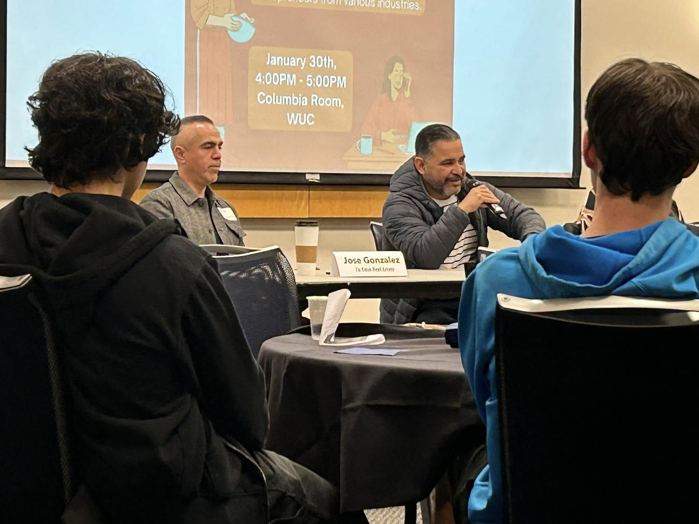
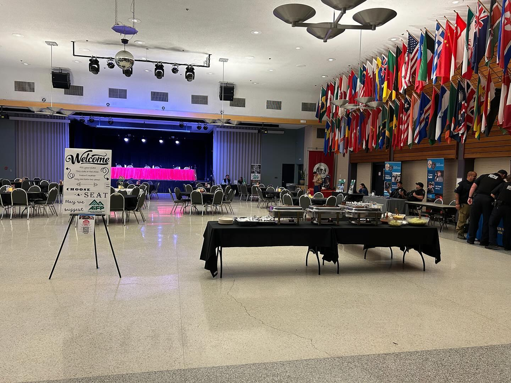
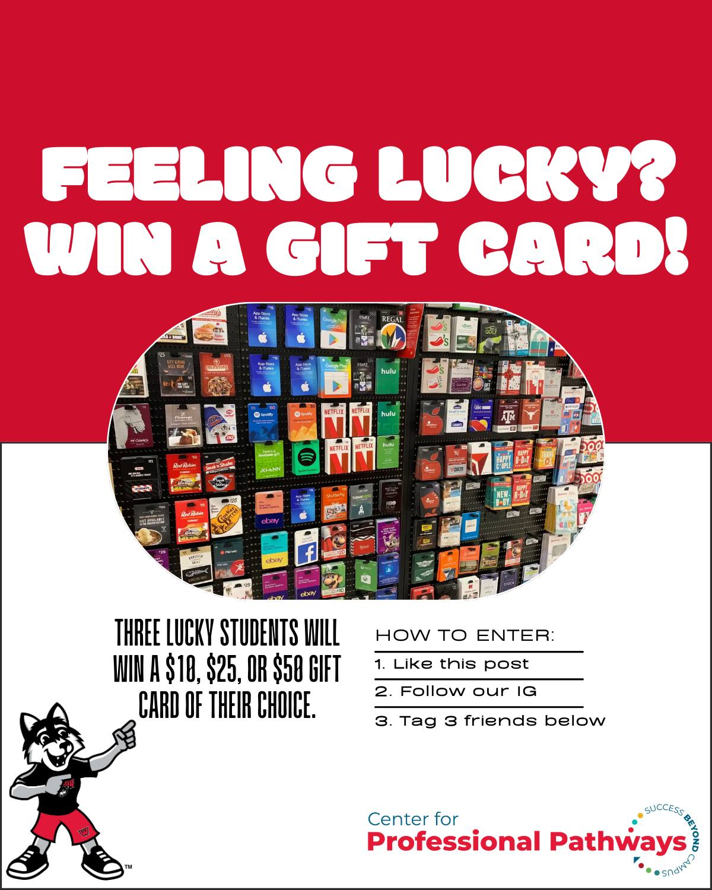
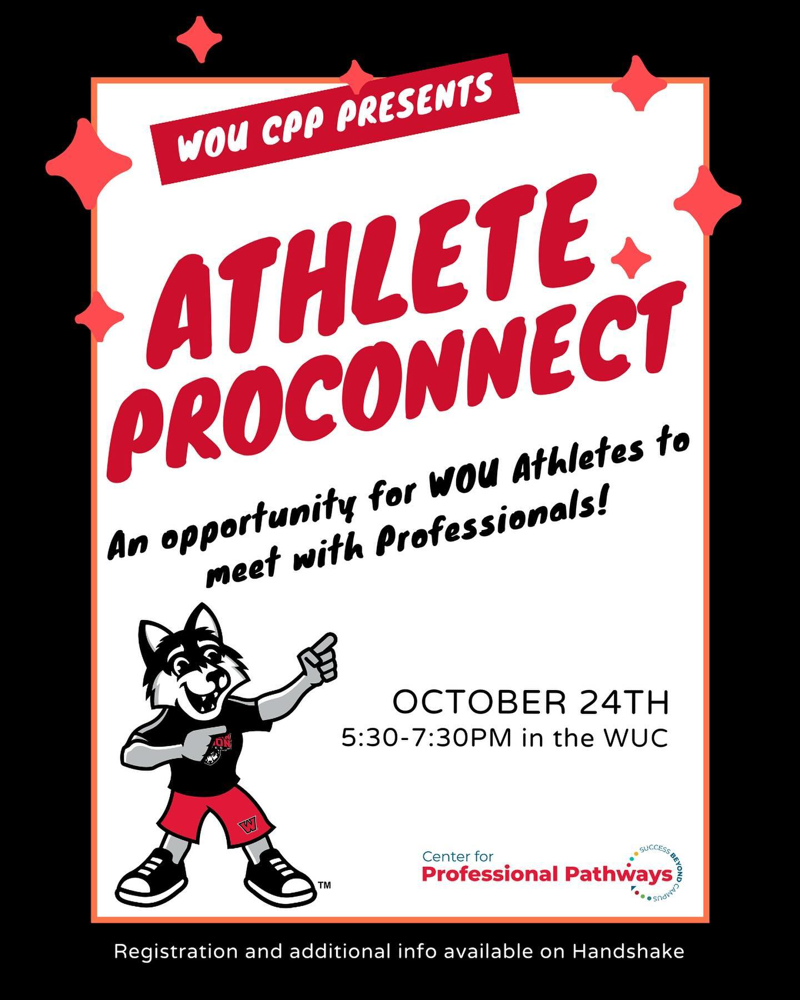

  
  <h1 style="font-size: 2.5rem; margin-bottom: 1rem; line-height: 1.1;">
    WOU Center for Professional Pathways: Incentivizing IG Follower Engagement
  </h1>

  

    In the 2023-24 academic year, I served as the Marketing Intern for the Western Oregon University Center for Professional Pathways. When I came on board, I identified that many students were aware of the CPP, but were hesitant to come in for a plethora of reasons. To get more students to come into the office and ask for career help required gaining their trust with our staff, so my social media strategy incorporated <strong>pushing content highlighted the office and the Peer Career Advisors in a fun manner</strong> while remaining an <strong>informative hub to learn about the CPP's events and services</strong>.
  

  

    
    
Photo from a WOU CPP LatinX Entrepreneurship Workshop

  

  

    
    
"Photo from the WOU CPP Athlete ProConnect Event

  

  

    
    
Graphic advertising a promotional gift card giveaway to incentivize IG followers

  

  

    
    
Graphic poster/advertisement for the Athlete ProConnect

  

  <a class="prev" onclick="plusSlides(-1)">&#10094;</a>
  <a class="next" onclick="plusSlides(1)">&#10095;</a>

 
  
  
 
    <h2>Strategy</h2> 
    

      My primary objective was to lower the barrier to entry for students seeking career advice. I focused on a strategy that <strong>demystified the CPP office</strong>, transforming it from an intimidating space into a welcoming, student-centric hub. The execution of this strategy involved a mix of content pillars:
    

    <ul style="max-width: none; margin-top: 10px;">
      <li>
        <strong>Humanizing the Brand:</strong> To overcome student hesitation, I prioritized content that highlighted the people behind the services. By featuring our <strong>Peer Career Advisors</strong> in fun, relatable social content, we were able to build trust with the student body, showing them that the CPP is staffed by approachable peers ready to help, rather than just administrators.
      </li>
      <li>
        <strong>Targeted Event Marketing:</strong> I developed specific promotional campaigns for key events to ensure diverse student attendance. This included designing graphics and messaging for specialized workshops like the <strong>LatinX Entrepreneurship Workshop</strong> and the <strong>Athlete ProConnect</strong>, ensuring these opportunities reached their specific target demographics effectively.
      </li>
      <li>
        <strong>Incentivized Engagement:</strong> To rapidly grow our digital footprint, I implemented promotional strategies such as a <strong>gift card giveaway</strong>. This campaign was a tangible success, directly resulting in a <strong>20% increase in Instagram followers</strong>. These efforts served a dual purpose: boosting our metrics and getting WOU students to follow the CPP's socials to stay up-to-date about its career events and services.
      </li>
    </ul>
  
 

  
 
    <h2>Tools Used</h2> 
    <ul style="max-width: none;"> 
      <li>
         <strong>Creative Design:</strong> I utilized <strong>Adobe Creative Cloud</strong> and <strong>Canva</strong> to design clean looking flyers, social media graphics, and digital signage that aligned with WOU and WOU CPP branding while appealing to a Gen Z audience.
      </li>
      <li style="margin-top: 10px;">
        <strong>Social Management:</strong> <strong>Meta Business Suite</strong> was essential for scheduling posts across Instagram and Facebook, analyzing engagement data, and managing our digital community efficiently.
      </li> 
      <li style="margin-top: 10px;">
        <strong>Collaboration:</strong> <strong>Google Suite</strong> facilitated seamless collaboration with the CPP staff and Peer Career Advisors to coordinate event calendars and approval workflows.
      </li>
    </ul>
  
 

