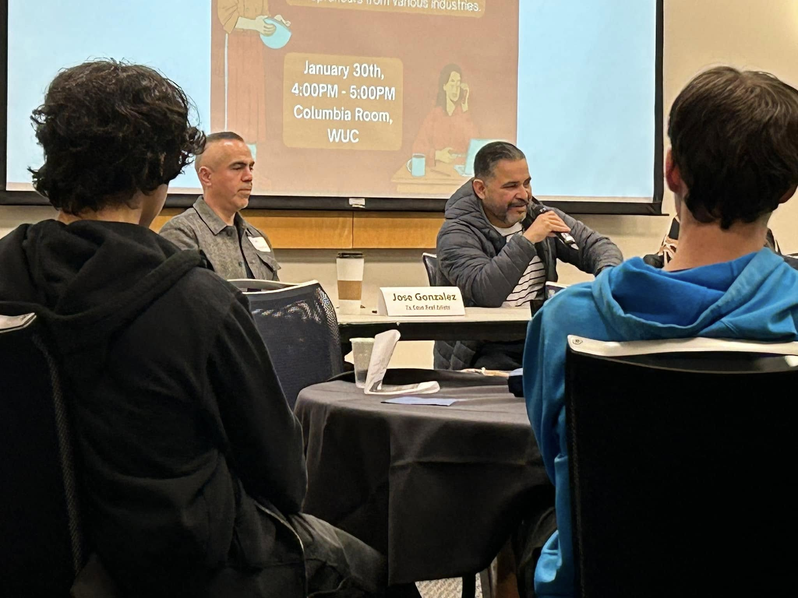
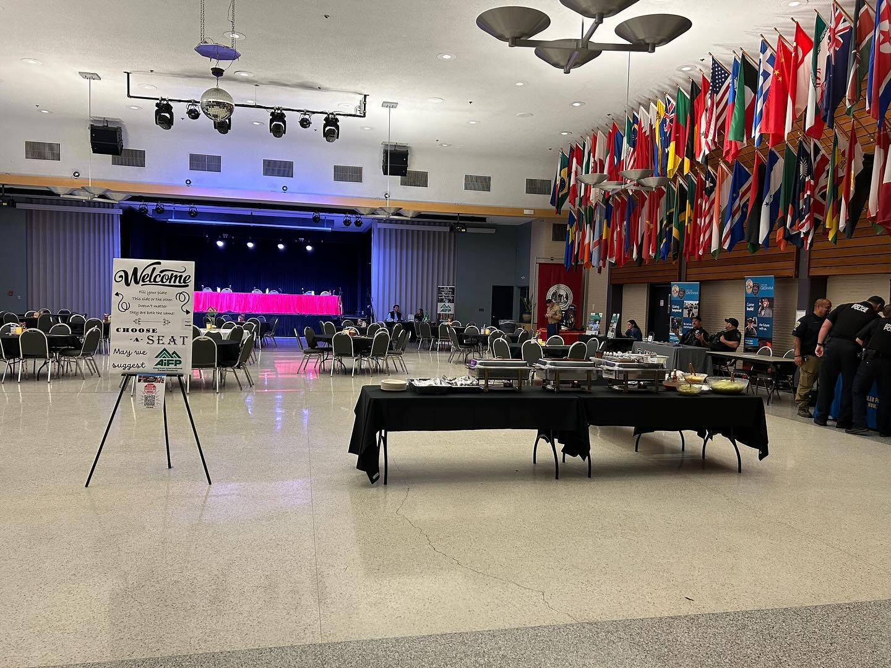
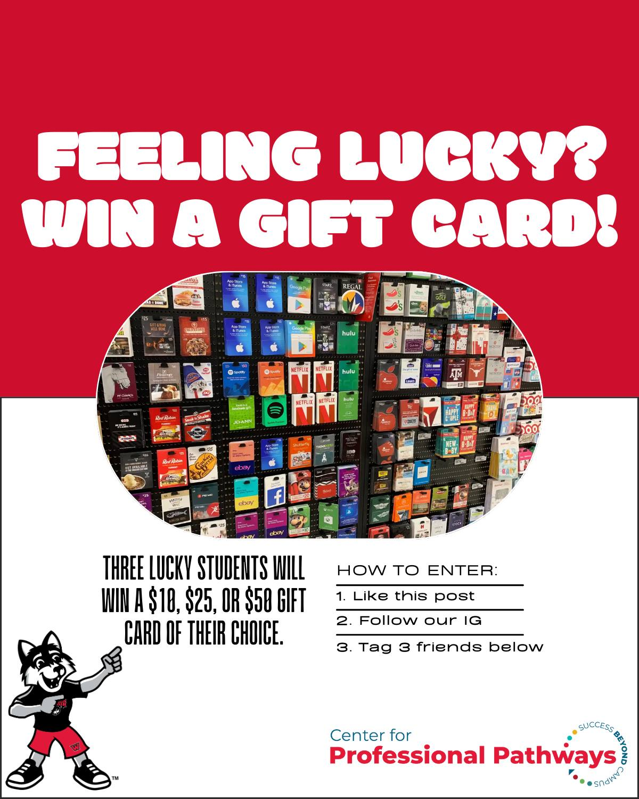
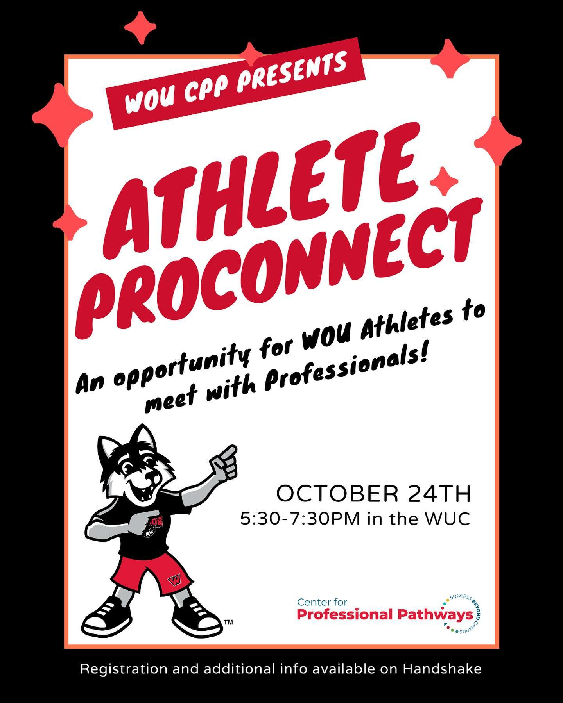

<link rel="stylesheet" href="../style.css">

<nav class="site-nav">
  Rami Dear
  <a href="../">Home</a>
  <a href="../marionberries">Marion Berries</a>
  <a href="../lobos">Los Lobos</a>
  <a href="../woucpp">WOU CPP</a>
  <a href="../content">Media</a>
  <a href="../about">About</a>
</nav>

  <h1 style="font-size: 2.5rem; line-height: 1.1; margin-bottom: 0.5rem;">WOU Center for Professional Pathways</h1>
  <h2 style="font-size: 1.5rem; color: #a0a0a0; font-weight: normal; margin-top: 0;">Incentivizing Instagram Follower Engagement</h2>

  <h2>The Objective</h2>
  

    Many students were aware of the CPP but hesitant to visit. My primary goal was to <strong>demystify the office</strong>, transforming it from an intimidating administrative space into a welcoming, student-centric hub.
  

  

    <h3 style="margin: 0;">Campaign Gallery</h3>
  

  

   

      
      
LatinX Entrepreneurship Workshop

    

   

      
      
Athlete ProConnect Event

    

   

      
      
Giveaway: +20% Follower Growth

    

   

      
      
Event Poster Design

    

   <button class="carousel-btn prev" aria-label="Previous slide">&#10094;</button>
    <button class="carousel-btn next" aria-label="Next slide">&#10095;</button>

  

  

    <h3>Humanizing the Brand</h3>
    

      I prioritized content that highlighted the people behind the services. By featuring our <strong>Peer Career Advisors</strong> in fun, relatable social content, we built trust by showing students that the CPP is staffed by approachable peers.
    

  

  

    <h3>Targeted Marketing</h3>
    

      I designed specific campaigns for key events to ensure diverse attendance. This included graphics for the <strong>LatinX Entrepreneurship Workshop</strong> and <strong>Athlete ProConnect</strong>, targeting specific student demographics.
    

  

  

    <h3>Incentivized Growth</h3>
    

      To rapidly grow our digital footprint, I implemented <strong>gift card giveaways</strong>. This campaign was a tangible success, resulting in a <strong>20% increase in Instagram followers</strong>.
    

  

  

    <h3>Tools Used</h3>
    <ul style="padding-left: 1.2rem; margin-top: 0.5rem;">
      <li><strong>Adobe Creative Cloud &amp; Canva:</strong> For professional-grade flyers and social graphics.</li>
      <li><strong>Meta Business Suite:</strong> For analytics and scheduling.</li>
      <li><strong>Google Suite:</strong> For collaboration with staff.</li>
    </ul>
  

